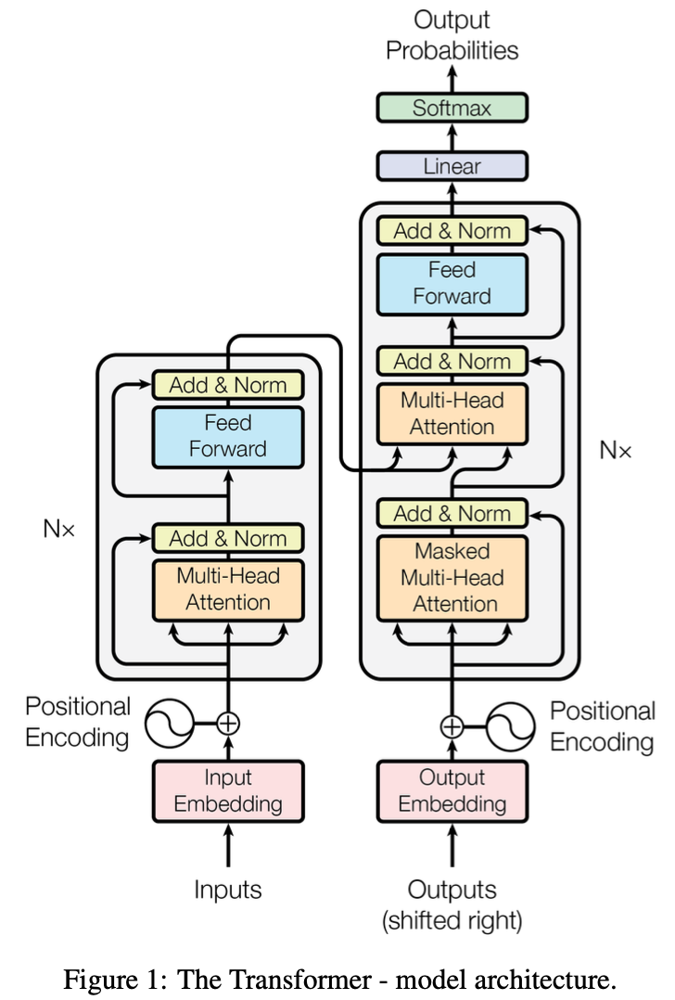

- [Original Paper: Attention Is All You Need](https://arxiv.org/abs/1706.03762)
- [The Annotated Transformer](https://nlp.seas.harvard.edu/annotated-transformer/)

# Paper reading 
- [Mu Li's Transformer论文逐段精读](https://www.youtube.com/watch?v=nzqlFIcCSWQ)
## Title + Authors 
Authors' contributions are clearly defined, providing a illustration of the workflow and structure of a deep learning research project. 

> [!info] 
> The title is catchy enough and upon its success there are lots of follow up paper of the format "X is all you need".
## Abstract
- "Sequence Transduction model": transduce one sequence to another sequence. 
- "Simple": in the past years, model were becoming more and more complicated. Simple (but working) is actually better
>[!Note]
> The experiments it conducts are machine translation tasks, the area which the Transformer originally envisioned to solve. But it turned out it is much more generalizable. 
## Conclusion
>[!Note]
>It is more common to place the link to the code to the end of Abstract. Nowadays deep learning architectures have so many details that paper alone cannot include them all. Having the code available so that people can repeat your results is really helpful in both ways. 

## Intro
- Encoder-decoder architecture
- Limitations of RNN: not parallelizable under the constraint of sequential computation
- Attention mechanisms can model dependencies independent of distance in input and output sequences. But rarely it is used alone without RNN.
- Therefore, they propose Transformer that rely entirely on an attention mechanism.
>[!Note]
>Neurips, the conference this paper appeared, accepts papers of single-column, 8 pages-ish. Therefore, the intro is short.  

## Relevant work/background
>[!Quote] Prior work
> CNN needs multiple steps to relate/aggregate local "patches" of information (some linear, some log). But CNN can output in multi-channels. 
> > [!Todo] What's new
> > Transformer reduces the relate operation to constant, and uses Multi-head Attention to output multi-channels. 

>[!Quote] Prior work
> Self-attention, as well as used with RNN or convolution, was introduced before
> > [!Todo] What's new
> > The first transduction model relying entirely on self-attention 
## Model
### Encoder-Decoder 
- The input to the encoder may be of different length of the output of the decoder
- The decoder outputs one at a time, while encoder may consume inputs all at once
- Decoder is autoregressive, i.e, the current output only depends on already generated output 
- Model graph

>[!Tip]
> A good graph is very important for popularizing your work: people can just grab your graph into their slides
- The residual connection simplifies the model because all sub-layers in the transformer block, as well as the embedding layers, produce outputs of the same dimension ($d_{model} = 512$). As as result, the hyper-parameters are kept to only a few. Another encoder-decoder architectural hyperparameter is $N$, number of transformer blocks in the encoder and decoder respectively. 
- LayerNorm (see [LayerNorm](Neural%20Networks_Zero%20to%20Hero.md#LayerNorm)) is chosen instead of BatchNorm because it is independent of both batch and sequence length:
	- for smaller batches, the sample mean and variances will be very volatile, 
	- during the inference the global average and variance are used and they cannot do better if the output sequence is longer than the global average
### Attention 
- introduces *attention*: query, key, value, output are all vectors. The dimension of query and key is the same in this paper, per requirement of the compatibility function used; dimension of value and output is the same, since output is the weighted sum of values
- different variants of attention have different compatibility score. The paper uses *scaled dot-product attention* that computes the dot-products between the query and the keys and scaled them by $\sqrt {d_k}$. Then it passes them to a softmax layer to get the weights (summed to 1) to get the weighted sum of values. 
- The scaling by $\sqrt {d_k}$ is to avoid extreme values that saturate softmax (96 vs 112 => 0.000001, 0.999999; 12 vs 14 => 0.12, 0.88). The gradient will be very small in the former case and will slow down the training. 

#### Multi-head attention
The vanilla (dot product) attention does not have parameters to learn given the inputs $Q, K, V$. Multi-Head attention linearly projects inputs $Q, K, V$ to some lower dimension $h$ times ($h$ channels), and concatenate the $h$ outputs and linearly project it back to $d_{model}$
### Three uses of attention in Transformer 
- In "encoder-decoder attention" layers, the queries come from the previous decoder layer, and the keys and values are the distinct transformations of the encoder output: for different decoder block, they share the same encoder output but transform it differently. 
- encoder self-attention
- decoder masked self-attention
### MLP
It first projects each output vector to a higher dimension ($d_{ff}$), and because of residual connection, it then projects back to the original dimension. 
### Embeddings
The input/output embedding layer and the final pre-softmax linear layer share the same weight matrix. 

They also multiply $\sqrt {d_{model}}$ to the two embedding layers (one for input and one for output) during both training and inference for each input. Without scaling, the embeddings, when initialized, would have norms around $\sqrt {d_{model}}$ (each component of the embedding vector is an independent random variables with mean 0 and variance 1). 

Scaling up allows the model to maintain a magnitude that is conducive to processing through the network's multiple layers without values diminishing too significantly. As later it will be [scaled down](#Attention).
### Why attention: table 1
- convolution: $k$: number of channels, since $k$ is usually small, we can see it as a constant. 
	- maximum path length: the length from an arbitrary location to another. Since convolution looks at a patch of k information at a time, hence $O(\log_k (n))$  
### Positional Encoding

## Experiment
- byte-pair encoding: encode sub-word to decrease vocabulary size (doing = do + ing)
- "shared source-target vocabulary": sharing the vocabulary so that they could share the same [embedding](#Embeddings)
### Optimizer 
- $lrate$ is inversely correlated with $d_{model}$ 

### Regularizer
- dropout = 0.1 to the output of each sub-layer before the residual add; and after the sum of embedding and  positional embedding. Essentially applying dropout after all operations with learnable weights. 
- [Label Smoothing](#Label%20Smoothing)

### Result
It uses [Beam Search](Dive%20into%20Deep%20Learning.md#Beam%20Search) during inference. 
## Discussion 
- Transformer does not have too many hyperparameters to tune => very convenient for other people
- Transformer now dominates not only language modeling, but also image and other modalities => multi-modal applications
- It turns out attention is not sufficient, MLP and residual connections are also important. 
## Label Smoothing
During training, **Label Smoothing** is a regularization technique that introduces noise for the labels. This accounts for the fact that datasets may have mistakes in them, so maximizing the likelihood of $\log{p}\left(y\mid{x}\right)$ directly can be harmful. Assume for a small constant $\epsilon$, the training set label $y$ is correct with probability $1 - \epsilon$. Label Smoothing regularizes a model based on a [softmax](https://paperswithcode.com/method/softmax) with $k$ output values by replacing the hard 0 and 1 classification targets with targets of $\frac{\epsilon}{k-1}$ and $1 - \epsilon$ respectively.

## Training 
It is straightforward that Encoder can be trained in parallel. The output of decoder is fed into the decoder. Decoder can also be trained in parallel using *teacher forcing*: instead of using the model's previous output as the next input, the entire target sequence ("`<sos>`I am happy") is provided at once (except the last token: `<eos>`) and a upper triangular mask is applied to it to preserve the autoregressive property in self-attention layers of the decoder blocks. The decoder will output a list of tokens corresponding to input sequences "`<sos>`", "`<sos>` I", ..., "`<sos>`I am happy". The loss is calculated by comparing the outputs with the desired outputs: the shift by 1 version of the input sequence: "I", "am", "happy", "`<eos>`". 

## BLEU
