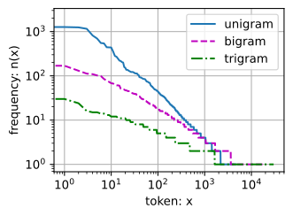

Applying deep learning requires simultaneously understanding:
1. the motivations for casting a problem in a particular way (**1: formulate problems**)
2. the mathematical form of a given model
3. the optimization algorithms for fitting the models to data
4. the statistical principles that tell us when we should expect our models to generalize to unseen data and practical methods for certifying that they have, in fact, generalized (**2-4: Math**)
5. the engineering techniques required to train models efficiently, navigating the pitfalls of numerical computing and getting the most out of available hardware (**5: implement**). 

Machine learning can program our subconscious cognitive processes that elude our conscious understanding. They can address low-level *perceptual* data in a way that previous tools could not. Inversely, current ML systems are not *explicitly* programmed to solve the problem (_end-to-end training_). Instead, it is flexible whose behavior is determined by a number of _parameters_ that is learnt from data.

A *model* is a program/function (with fixed parameters) that produces a set of unique input-output mappings. 

A *model family* is the set of functions that we can produce by manipulating the parameters. 

A *learning algorithm* is a function that takes as input a dataset and outputs another function: the learned model. 

# 1. Intro
## Key components
- Data
	- fixed-length data (more assumption) vs varying-length data 
- Models
	- In essence, models are *data transformations*. To learn a model is to learn a data transformation that fits our needs. 
	- In particular, we are interested in _statistical models_ that can be estimated from data. 
- Objective Functions
	- By convention, it is also called loss function; differentiable vs non-differentiable; optimize surrogate objective if the objective is hard to optimize.
- Optimization Algorithms

## ML Taxonomy
### Supervised Learning
Predicting the labels given input features. In probabilistic terms, we typically are interested in estimating the conditional probability of a label given input features. Many sub-types, depending on (among other considerations) the type, size, and quantity of the inputs and outputs.
- regression: continuous output 
- classification: discrete output 
- tagging: multi-label classification: one input could have multiple tags/classes. 
- sequence learning: inputs and outputs consist of variable-length sequences:
	- audio-to-text: many to few
	- text-to-audio: few to many
	- machine translation: unaligned input and output 

### Unsupervised Learning 
- clustering 
- subspace estimation: e.g. PCA
- representation
- causality
- generative models: learn the density of the data (to score examples or to generate examples)
	- variational autoencoder
	- Generative adversarial network
	- normalizing flow
	- diffusion model

#### Self-supervised learning 
- leverage unlabeled data to provide supervision. For example, we can train models to “fill in the blanks” by predicting randomly masked words/images. 

If the model does not impact the environment other than it is trained on inputs made by the environment, it is called offline learning. The upside of it is that we can worry about pattern recognition in isolation. But this problem formulation is limiting: we want to think about intelligent _agents_ that impact the environment, not just predictive models. Impacting environment will in turn impact the future observations of itself, creating _distribution shift_. 

### Reinforcement Learning 
Reinforcement learning gives a very general statement of a problem in which an agent interacts with an environment over a series of time steps. At each time step, the agent receives some _observation_ from the environment and must choose an _action_ that is subsequently transmitted back to the environment, when, after each loop, the agent receives a *reward* from the environment. The goal of reinforcement learning is to produce good policies, functions that map from observations of the environment to actions.

#### RL vs Supervised Learning 
RL framework is extremely general, that supervised learning can be recast as reinforcement learning. Further, reinforcement learning can also address many problems that supervised learning cannot, because in RL we do not assume that, for each observation the environment tells us the optimal action. In general, we just get some reward. Moreover, the environment may not even tell us which actions led to the reward.

#### Challenges of RL
- _credit assignment_ problem: for example in chess, the only reward happens at the end of the chess. We need to take care of the reward in the intermediate steps 
- partial observability: When the environment is fully observed, we call the reinforcement learning problem a _Markov decision process_.
- exploit vs explore tradeoff

## Progress so far
### Compute 
Note that random-access memory has not kept pace with the growth in data. At the same time, increases in computational power have outpaced the growth in datasets. This means that statistical models need to become more memory efficient, and so they are free to spend more computer cycles optimizing parameters, thanks to the increased compute budget. Consequently, the sweet spot in machine learning and statistics moved from (generalized) linear models and kernel methods to deep neural networks.

### Algorithm
- overfitting mitigation: dropout 
- attention mechanism: Neural Machine Translation by Jointly Learning to Align and Translate. It solves how to increase the memory and complexity of a system without increasing the number of learnable parameters. Researchers uses what can be viewed as a _learnable pointer structure_ that stores not the entire sequence but the pointer to it. 
- transformer: scaled-up attention
- generative adversarial networks: Traditionally, statistical methods for density estimation and generative models focused on finding proper probability distributions and (often approximate) algorithms for sampling from them. As a result, these algorithms were largely limited by the lack of flexibility inherent in the statistical models. The crucial innovation in generative adversarial networks was to replace the sampler by an arbitrary algorithm with differentiable parameters. These are then adjusted in such a way that the discriminator (effectively a two-sample test) cannot distinguish fake from real data. Through the ability to use arbitrary algorithms to generate data, density estimation was opened up to a wide variety of techniques: diffusion
- parallel computation 
- Deep learning framework such as pytorch. 

## Deep Learning essence
- end-to-end training
- parametric statistical descriptions to fully nonparametric models: When data is scarce, one needs to rely on simplifying assumptions about reality in order to obtain useful models. When data is abundant, these can be replaced by nonparametric models that better fit the data. This has led to much more accurate models, albeit often at the expense of interpretation.
- new-found empiricism: the acceptance of suboptimal solutions, dealing with nonconvex nonlinear optimization problems, and the willingness to try things before proving them.

# Preliminaries 
## Data Manipulation
Some properties of tensors that we may be interested to know and manipulate:
- `.shape`: `reshape` (may or may not return a new copy, work with non-row-contiguous tensor), `view` (not return a copy, work with contiguous tensor only)
- `.numel()`: number of elements 
- `.id()`:  checks the memory address of the tensor
- `type()`

### Indexing and slicing 
- negative index: start from the end
- `,` to separate dimension/axis
-  when only one index (or slice) is specified for a tensor: it is applied along axis 0
- use slicing to specify many indices systematically

#### slicing 
- `[start:stop:step]`: the general format. `start`, `stop`, and `step` are optional, so the slicing may look like: 
	- `[::]`: the whole axis
	- `[::step]`: the whole axis at every `step`
	- `[start::step]`: from `start` to end at every `step`

### Operations
#### Unary Operation
apply a standard scalar operation to each element of a tensor. E.g. `.exp(2)`

#### Binary Operation 
takes two tensor and elementwise apply some binary operation. E.g: `+`, `**`, "!="

#### Aggregation
- `sum`, `max`, `mean`, `min`: can be operated on the whole tensor or along one dimension

#### N-ary Operation
`cat` can concatenate tensors along an axis. 

#### Broadcasting 
For broadcasting semantics: see [Code Optimization](Neural%20Networks_Zero%20to%20Hero.md#Code%20Optimization)
#### In-place operation
Does not require reallocating new memory. The reallocation can be spotted by `.id()`. 
- `+=`, etc
- use `[:]` to overwrite a tensor in-place. 

### Conversion 
- tensor to numpy nd array: `.numpy()` with caveats:
	- the numpy array and the tensor will share the memory
	- if the tensor is on GPU, it needs to be moved to cpu using `.cpu()`
	- if the tensor is in a computation graph (`requires_grad=True`), the we need to `.detach()` it first, in which we create a new tensor that does not track gradient, and convert that tensor to a numpy array. 
	- if the data type of the tensor is not supported in numpy, convert it to the datatype numpy supports first
- numpy to tensor: `torch.from_numpy()` with the same caveats:
	- memory-sharing 
	- careful about the data type 
	- it will loads in to CPU. Use `.to('cuda')` to load to GPU
	- use `.requires_grad_(True)` to track gradients. Make sure the tensor is float is best practice. 
- `.item()`: convert a single-element tensor into a Python scalar
- tensor to python list: `.tolist()`

## Data Preprocessing

## Object-Oriented Design
At at a high level we wish to have three classes: (i) `Module` contains models, losses, and optimization methods; (ii) `DataModule` provides data loaders for training and validation; (iii) both classes are combined using the `Trainer` class, which allows us to train models on a variety of hardware platforms.

Class definitions tend to be fairly long blocks of code, while Jupyter Notebook readability demands short code fragments, interspersed with explanations. 

### Model
The `Module` class is the base class of all models (a subclass of `nn.module`) . 

### Data
The `DataModule` class is the base class for data. The `__init__` method is used to prepare the data. This includes downloading and preprocessing if needed. The `train_dataloader` returns the data loader for the training dataset. A data loader is a generator that yields a data batch each time it is used. This batch is then fed into the `training_step` method of `Module` to compute the loss. There is an optional `val_dataloader` to return the validation dataset loader. It behaves in the same manner, except that it yields data batches for the `validation_step` method in `Module`.


## Linear Algebra
### Order vs Dimensionality
- Order: number of axes 
- Dimensionality: length along a certain axis
- Therefore, scalars are 0th-order tensors and vectors are 1st-order tensors, matrices are 2nd-order tensors, and tensors are in general nth-order. `.shape` will reflect this: 0th-order tensor's shape will be a empty tensor.  

### Products 
#### Dot products
AKA, inner product. Given two column vectors $\mathbf x, \mathbf y \in \mathbb{R}^{d}$, the dot product is defined as $\mathbf x^T\mathbf y$. 
- Semantics: 
	- weighted sum
	- cosine of the angle b/w two vectors: after normalizing two vectors to have unit length

#### Matrix–Vector Products
$$\begin{split}\mathbf{A}\mathbf{x}
= \begin{bmatrix}
\mathbf{a}^\top_{1} \\
\mathbf{a}^\top_{2} \\
\vdots \\
\mathbf{a}^\top_m \\
\end{bmatrix}\mathbf{x}
= \begin{bmatrix}
 \mathbf{a}^\top_{1} \mathbf{x}  \\
 \mathbf{a}^\top_{2} \mathbf{x} \\
\vdots\\
 \mathbf{a}^\top_{m} \mathbf{x}\\
\end{bmatrix}\end{split}$$
The matrix–vector product $\mathbf A \mathbf x$ is simply a column vector of length $m$, whose $i^{th}$ element is the dot product $\mathbf a_{1}^T \mathbf x$, where each $\mathbf a_{i}^T \in \mathbb R^n$ is a row vector representing the $i^{th}$ row if the $m \times n$ matrix $\mathbf A$. 

$\mathbf A$ can be seen as a transformation that projects vectors from $\mathbb R^n$ to $\mathbb R^m$. Many operations such as rotations can be represented by some transformations. 

#### Matrix–Matrix Multiplication
$\mathbf A \in \mathbb R^{n \times k}$ and $\mathbf B \in \mathbb R^{k \times m}$
$$\begin{split}\mathbf{C} = \mathbf{AB} = \begin{bmatrix}
\mathbf{a}^\top_{1} \\
\mathbf{a}^\top_{2} \\
\vdots \\
\mathbf{a}^\top_n \\
\end{bmatrix}
\begin{bmatrix}
 \mathbf{b}_{1} & \mathbf{b}_{2} & \cdots & \mathbf{b}_{m} \\
\end{bmatrix}
= \begin{bmatrix}
\mathbf{a}^\top_{1} \mathbf{b}_1 & \mathbf{a}^\top_{1}\mathbf{b}_2& \cdots & \mathbf{a}^\top_{1} \mathbf{b}_m \\
 \mathbf{a}^\top_{2}\mathbf{b}_1 & \mathbf{a}^\top_{2} \mathbf{b}_2 & \cdots & \mathbf{a}^\top_{2} \mathbf{b}_m \\
 \vdots & \vdots & \ddots &\vdots\\
\mathbf{a}^\top_{n} \mathbf{b}_1 & \mathbf{a}^\top_{n}\mathbf{b}_2& \cdots& \mathbf{a}^\top_{n} \mathbf{b}_m
\end{bmatrix}\end{split}$$
### Norms
A norm ($\|·\|$) is a function that maps a vector to a scalar and satisfies the following three properties:
1. $\|\alpha \mathbf{x}\| = |\alpha| \|\mathbf{x}\|.$
2. $\|\mathbf{x} + \mathbf{y}\| \leq \|\mathbf{x}\| + \|\mathbf{y}\|.$
3. $\|\mathbf{x}\| > 0 \textrm{ for all } \mathbf{x} \neq 0.$
Many functions are valid norms and different norms encode different notions of size.

Example norms:
- L1 norm: `torch.abs(u).sum()`
- L2 norm: `torch.norm(u)`
- or more generally: $\|\mathbf{x}\|_p = \left(\sum_{i=1}^n \left|x_i \right|^p \right)^{1/p}$

Norms constitute the objectives of deep learning algorithms. 

## Calculus 
Differential calculus can tell us how to increase or decrease a function’s value by manipulating its arguments.
### Automatic Differentiation
 PyTorch does not automatically reset the gradient buffer when we record a new gradient. Instead, the new gradient is added to the already-stored gradient. This behavior comes in handy when we want to optimize the sum of multiple objective functions.
#### Backward for Non-Scalar Variables
When `y` is a vector, the most natural representation of the derivative of `y` with respect to a vector `x` is a matrix called the _Jacobian_ that contains the partial derivatives of each component of `y` with respect to each component of `x` (m by n if `len(y) == m, len(x) == n`. 
$$J = \begin{bmatrix}
\frac{\partial y_1}{\partial x_1} & \cdots & \frac{\partial y_1}{\partial x_n} \\
\vdots & \ddots & \vdots \\
\frac{\partial y_m}{\partial x_1} & \cdots & \frac{\partial y_m}{\partial x_n}
\end{bmatrix}
$$
more commonly we want to sum up the gradients of each component of `y` with respect to the full vector `x`, yielding a vector of the same shape as `x`. 

In pytorch, `backward()` on a non-scalar elicits an error unless we tell PyTorch how to reduce the object to a scalar. More formally, we need to provide some vector $\mathbf v$ such that `backward()` will compute $\mathbf v^{T}\partial_{\mathbf x} \mathbf y$, Vector-Jacobian Product (VJP),  rather than $\partial_{\mathbf x} \mathbf y$. See Yang Zhang’s [Medium post](https://zhang-yang.medium.com/the-gradient-argument-in-pytorchs-backward-function-explained-by-examples-68f266950c29).
```
x.grad.zero_()
y = x * x
y.backward(gradient=torch.ones(len(y)))  # Faster: y.sum().backward()
x.grad
```
`gradient=torch.ones(len(y))` is $\mathbf v$ that does the sum using dot product (by extension, we can pass in custom $\mathbf v$. We can also use `.sum()` to make `y` a scalar before using `backward()`. 

Usually, this is not an issue because we usually call `backward()` on a scalar loss, which already is the reduced form: $\mathbf v$ essentially explicitly tells how each component of `y` is to the loss. 

#### Detach

#### Dynamic control flow
Pytorch can also deal with this automatically. 

## Probability and Statistics
Probability: Given a probabilistic model of some process, we can reason about the likelihood of various events. _Frequentist_ scholars adhere to an interpretation of probability that applies _only_ to such repeatable events. By contrast _Bayesian_ scholars use the language of probability more broadly to formalize reasoning under uncertainty. Bayesian probability is characterized by two unique features: (i) assigning degrees of belief to non-repeatable events, e.g., what is the _probability_ that a dam will collapse?; and (ii) subjectivity: it allows for different individuals to start off with different _prior_ beliefs, while Bayesian probability provides unambiguous rules for how one should update their beliefs in light of new evidences.

 _Statistics_ helps us to reason backwards, starting off with collection and organization of data and backing out to what inferences we might draw about the process that generated the data.
### Probability
See [Chapter 1 Probability](All%20of%20Statistics.md#Chapter%201%20Probability)

### Random Variable 
See [Chapter 2 Random Variable](All%20of%20Statistics.md#Chapter%202%20Random%20Variable)
Random variables are mappings from an underlying sample space to a set of values that assigns a real number to each outcome: both are collections of outcomes. 
 
Importantly, random variables can be much coarser than the raw sample space. We can define a binary random variable like “greater than 0.5” even when the underlying sample space is infinite, e.g., points on the line segment between 0 and 1. Additionally, multiple random variables can share the same underlying sample space. For example “whether my home alarm goes off” and “whether my house was burgled” are both binary random variables that share an underlying sample space. Consequently, knowing the value taken by one random variable can tell us something about the likely value of another random variable.
 
Discrete random variable vs Continuous random variable: mass vs density

#### Multiple Random Variables 
Most of machine learning is concerned with relationships among multiple RVs. Each random variable would represent the (unknown) value of a different attribute. Whenever we sample an individual from the population, we observe a realization of each of the random variables.

Because the values taken by random variables correspond to subsets of the sample space that could be overlapping, partially overlapping, or entirely disjoint, knowing the value taken by one random variable can cause us to update our beliefs about which values of another random variable are likely.

When we have multiple RVs, we can construct events that go beyond a single RV: 
- _joint probability_ function: assigns a probability to the event where random variables A and B take values a and b: $P(A = a, B = b)$ . It can be used to recover the *marginal distribution*: $P(A=a) = \sum_v P(A=a, B=v)$ 
- *conditional probability*: $P(B=b \mid A=a) = P(A=a,B=b)/P(A=a)$ , which leads to Bayes's Theorem: $P(A \mid B) = \frac{P(B\mid A) P(A)}{P(B)}.$ This is profound because if $P(A \mid B)$ is hard to get, and we know the other three, we could get it. Actually, if $P(B)$ is hard to get, we are confident that $P(A \mid B) \propto P(B \mid A) P(A)$ because $P(B)$ is just a normalizing constant so that $\sum_a P(A=a \mid B) = 1$. $P(B)$ can be calculated as: $\sum_a P(B \mid A=a) P(A=a) = \sum_a P(B, A=a) = P(B)$ 
- In Bayesian statistics, we think of an observer as possessing some (subjective) prior beliefs about the plausibility of the available hypotheses encoded in the _prior_ $P(H)$, and a _likelihood function_ that says how likely one is to observe any value of the collected evidence for each of the hypotheses in the class $P(E \mid H)$. Bayes’ theorem is then interpreted as telling us how to update the initial _prior_ $P(H)$, in light of the available evidence $E$ to produce _posterior_ beliefs $P(H \mid E) = \frac{P(E \mid H) P(H)}{P(E)}$. Informally, this can be stated as “posterior equals prior times likelihood, divided by the evidence”.
- Independent/dependent: successive sample draws, relationship among RVs ()
- Conditionally independent/dependent: two random variables $A$ and $B$ are _conditionally independent_ given a third variable $C$ if and only if $P(A, B \mid C) = P(A \mid C)P(B \mid C)$. 
	- Two variables can be independent in general but become dependent when conditioning on a third. This often occurs when the two random variables $A$ and $B$ both causes $C$. 
	- conversely, two dependent random variables can become independent upon conditioning on a third.

### Expectation 
See [Chapter 3 Expectation](All%20of%20Statistics.md#Chapter%203%20Expectation)
The expectation of an RV is itself weighted by corresponding probabilities, averaged over all outcomes. Formally, $E[X] = E_{x \sim P}[x] = \sum_{x} x P(X = x)$ or $E[X] = \int x \;dp(x)$. 

Sometimes we are interested in the expected value of some function of $x$: 
$E_{x \sim P}[f(x)] = \sum_x f(x) P(x) \textrm{ and } E_{x \sim P}[f(x)] = \int f(x) p(x) \;dx$. One function that we are interested is the variability of the RV $X$: $\textrm{Var}[X] = E\left[(X - E[X])^2\right] = E[X^2] - E[X]^2$. The square root of $\textrm{Var}[X]$ has the nice property that it is expressed in the same units as $X$. 

## Documentation
- `dir(torch.x)` to show all the functions and classes in the `x` module, for each function or class, we could use
- `help(func)`. In Jupyter notebook, `?` can display the help, and `??` will display the code. 

# Linear Neural Nets: Regression

## Linear Regression
- Formula: for a single $y, y = \mathbf{w}^\top \mathbf{x} + b + \epsilon \textrm{ where } \epsilon \sim \mathcal{N}(0, \sigma^2)$.
- This formula assumes a linear relationship between $x$ and $y$. Further it assumes a Gaussian error (a good assumption for confidence interval and hypothesis testing). 
Therefore, $f(\epsilon) = \frac{1}{\sqrt{2\pi \sigma^2}} e^{-\frac{\epsilon^2}{2\sigma^2}}$, where $f(\epsilon)$ is the probability density function of $\epsilon$. 
Given this model, the output $y$ for any given $\mathbf x$ is also normally distributed because it is a linear transformation of $ϵ$, which is Gaussian. Specifically, the distribution of $y$ given $\mathbf x$ is:
- $y \mid \mathbf{x} \sim N(\mathbf{w}^\top \mathbf{x} + b, \sigma^2)$. Therefore, $P(y \mid \mathbf{x}) = \frac{1}{\sqrt{2 \pi \sigma^2}} \exp\left(-\frac{1}{2 \sigma^2} (y - \mathbf{w}^\top \mathbf{x} - b)^2\right)$. 

Then, the likelihood of all data is $P(\mathbf y \mid \mathbf X) = \prod_{i=1}^{n} p(y^{(i)} \mid \mathbf{x}^{(i)})$, under the assumption of independence of examples $(y^{(i)}, \mathbf x^{(i)})$. The sum of negative log likelihood we want to minimize (equivalent to maximize likelihood) is $-\log P(\mathbf y \mid \mathbf X) = \sum_{i=1}^n \frac{1}{2} \log(2 \pi \sigma^2) + \frac{1}{2 \sigma^2} \left(y^{(i)} - \mathbf{w}^\top \mathbf{x}^{(i)} - b\right)^2$, which is the same as **square loss**. 

In summary: it follows that minimizing the mean squared error is equivalent to the maximum likelihood estimation of a linear model under the assumption of additive Gaussian noise.

## Generalization
We assume that the training data and the test data are drawn _independently_ from _identical_ distributions (IID). There are two types of errors: 
- _training error_: $R_\textrm{emp}[\mathbf{X}, \mathbf{y}, f] = \frac{1}{n} \sum_{i=1}^n l(\mathbf{x}^{(i)}, y^{(i)}, f(\mathbf{x}^{(i)}))$
- generalization error: an _expectation_ taken with respect to the underlying distribution of (training and test data): $R[p, f] = E_{(\mathbf{x}, y) \sim P} [l(\mathbf{x}, y, f(\mathbf{x}))] = \int \int l(\mathbf{x}, y, f(\mathbf{x})) p(\mathbf{x}, y) \;d\mathbf{x} dy.$ However, we cannot calculate the generalization error $R$, because we do not know $p(\mathbf{x}, y)$. In practice, we must _estimate_ the generalization error by applying our model to an independent test set constituted of a random selection of examples. 
- why test error is a better indicator of $R$: it is an unbiased estimator, meaning the mean of test error is $R$. However, the training error is a biased estimator as the model depends on the training data. The central question of generalization is to bring training error close to the population error. 

### Underfitting vs Overfitting
- Underfitting: $R_\textrm{emp} \approx R$ and both are high, and $R_\textrm{emp}$ cannot be driven down. The current model is too simple. 
- Overfitting: $R_\textrm{emp} >> R$. Note that overfitting is not always a bad thing. In deep learning especially, the best predictive models often perform far better on training data than on holdout data. Ultimately, we usually care about driving the generalization error lower, and only care about the gap insofar as it becomes an obstacle to that end. Note that if the training error is zero, then the generalization gap is precisely equal to the generalization error and we can make progress only by reducing the gap.

### Model complexity vs Data size
- Often but not always, the number of parameters, and the range the parameters determine the model complexity, but those two are not comparable across algorithms (decision tree vs neural net). In the case of polynomial curve fitting, higher-order polynomial functions (more complex models) should always achieve lower training error relative to lower-degree polynomials. In fact, whenever each data example has a distinct value of 𝑥, a polynomial function with degree equal to the number of data examples can fit the training set perfectly. 
- This leads to the other aspect that determines the generalization loss: as we increase the amount of training data, the generalization error typically decreases.

### (K-fold Cross-)Validation for model selection
When training data is scarce, we might not be able to hold out a separate validation set. We can use $K-$fold cross-validation:  the original training data is split into 𝐾 non-overlapping subsets. Then model training and validation are executed 𝐾 times, each time training on 𝐾−1 subsets and validating on the remaining subset. Finally, the training and validation errors are estimated by averaging over the results from the 𝐾 experiments.


## Weight Decay


# Builder's guide
## Modules

### Levels of Abstraction of NN
#### Single neuron: 
takes a set of inputs (from previous layer's neurons' outputs), generate a scalar output using a weighted sum of inputs. 
#### Layer:
a vector of neurons on the same inputs. 
#### Model:
All the layers. 

A *module* could describe a single layer, a component consisting of multiple layers, or the entire model itself, so that we can decompose any complex NN into modules recursively. 

### Programming modules 
A module is represented by a _class_. Any subclass of it must define a forward propagation method that transforms its input into output and must store any necessary parameters. The backprop method is supplied behind the scene. 

#### Example: MLP
one hidden layer with 256 hidden units, and a 10-dimensional output layer. 
```
class MLP(nn.Module):
    def __init__(self):
        # Call the constructor of the parent class nn.Module to perform
        # the necessary initialization
        super().__init__()
        # nn.LazyLinear deduces the first dimension from the input data. 
        self.hidden = nn.LazyLinear(256)
        self.out = nn.LazyLinear(10)

    # Define the forward propagation of the model, that is, how to return the
    # required model output based on the input X
    def forward(self, X):
        return self.out(F.relu(self.hidden(X)))
```
The instantiation and the forward pass: 
```
net = MLP()
net(X)
```

Or, we can use `nn.Sequential()`:
```
net = nn.Sequential(nn.LazyLinear(256), nn.ReLU(), nn.LazyLinear(10))
```

## Parameters 

### Accessing parameters
When a model is defined via the `Sequential` class, we can first access any layer by indexing into the model. Plus, each layer’s parameters can be accessed via its attributes. Together, we can:
```
net[2].state_dict()
```
Or, we can access all the parameters 
```
for name, param in net.named_parameters()
```
### Shared parameters 
Example: 
```
shared = nn.LazyLinear(8)
net = nn.Sequential(nn.LazyLinear(8), nn.ReLU(),
                    shared, nn.ReLU(),
                    shared, nn.ReLU(),
                    nn.LazyLinear(1))
```

## File I/O

### Save model parameters 
```
torch.save(net.state_dict(), 'mlp.params')
```
### Load model parameters 
```
clone = MLP()
clone.load_state_dict(torch.load('mlp.params'))
net(X) == clone(X) # should return True
```

# Recurrent Neural Network 
- Before we focused on tabular data, assuming that each feature vector $\mathbf 𝑥_𝑖$ consisted of a fixed number of components $x_{1}, ..., x_{d}$. However, many tasks that has varying length inputs (video) and/or outputs (image captions). See [Sequence](Modeling%20Sequence.md#Sequence). 
- RNN deals with this challenge by seeing sequence data as varying-length sequences of fixed-length vectors and process each fixed-length vector in a loop. 
- A good review paper: [A Critical Review of Recurrent Neural Networks for Sequence Learning](https://arxiv.org/abs/1506.00019)

## Autoregressive Models 
At each _time step_ $t \in \mathbb{Z}^{+}$, we observe the value $x_t$. Suppose we want to know $P(x_{t+1} \mid x_{t}, \ldots, x_1)$, or a statistics of the distribution $\mathbb{E}[(x_t \mid x_{t-1}, \ldots, x_1)]$. The challenge of fitting some model to it is that it has varied length $x$, which is dependent on $t$. There are two common strategies: 
- fixed window size $\tau$:  instead of condition on the entire history, only condition on the last $\tau$ steps. 
- latent autoregressive models: maintain some summary $ℎ_t$ of the past observations. The model estimates not only $x_{t+1}=P(x_t\mid h_t)$ but also updates $h_t=g(ℎ_{t−1},x_{t−1})$

Either way, we construct training data from historical data by sampling, because we assume the dynamics according to which each subsequent observation is generated given the previous observations do not change: the *stationary assumption*.

## Sequence Models
Sequence models (language models for language data) estimates the joint probability of an entire sequence composed of discrete tokens such as words. It can not only _evaluate_ the likelihood of the entire sequence, but also _sample_, and optimize for the most likely sequence. 

### Sequence model to autoregressive model
$P(x_1, \ldots, x_T) = P(x_1) \prod_{t=2}^T P(x_t \mid x_{t-1}, \ldots, x_1)$
This left to right, token by token decomposition makes $P(x_t \mid x_{t-1}, \ldots, x_1)$ (modeled by an autoregressive model) a probabilistic classifier, outputting a full probability distribution over the vocabulary for whatever word will come next, given the leftwards context.
### Markov Models 
Markov models model sequences that satisfy the Markov condition, i.e., _given the recent history, that the future is conditionally independent of the past_. When $\tau=1$, we say that the data is characterized by a _first-order Markov model_, and when $\tau=k$ we say that the data is characterized by a $k^{th}$-order Markov model.

We don't check whether sequences we are interested in satisfy the Markov condition, we just assume it to be true for our $k$: of course the more context we have the better, the gains diminish rapidly. So we compromise. Even today’s massive RNN- and Transformer-based language models seldom incorporate more than thousands of words of context.

### Exploratory Language Statistics
#### Zipf's law 
$\log n_i = -\alpha \log i + c$, where $n_i$ is the frequency of the $i^{th}$ most frequent n-gram (a log-log linear relationship between frequency and rank). 

#### Distribution of frequency vs rank

- Beyond unigram words, sequences of words also appear to be following Zipf’s law, albeit with a smaller exponent $\alpha$. 
- the number of distinct $n$-grams is not that large. This gives us hope that there is quite a lot of structure in language.
- many $n$-grams occur very rarely: there will be many plausible three-word combinations that we likely will not see in our dataset. Unless we provide some solution to assign such word combinations a nonzero count, we will not be able to use them in a language model. 
#### Laplace Smoothing
A common strategy is to add a small constant to all counts to avoid zero count n-grams. 

### Drawbacks of counts-based language model
- we need to store all counts
- it entirely ignores the meaning of the words.
- does not work well with long, novel sequence 
- the number of model parameters would also increase exponentially with context size. 

## Perplexity
The quality of the language model. We can measure it by the cross-entropy loss averaged over all the $n$ tokens of a sequence, so that longer sequence does not necessarily have lower score: 
$\frac{1}{n} \sum_{t=1}^n -\log P(x_t \mid x_{t-1}, \ldots, x_1)$, where $P$ is given by a language model and $x_t$ is the actual token observed at time step $t$ from the sequence. Perplexity is: $\exp\left(-\frac{1}{n} \sum_{t=1}^n \log P(x_t \mid x_{t-1}, \ldots, x_1)\right).$ 
- In the best case scenario, the model always perfectly estimates the probability of the target token as 1. In this case the perplexity of the model is 1.
- In the worst case scenario, the model always predicts the probability of the target token as 0. In this situation, the perplexity is positive infinity. 
- At the baseline, the model predicts a uniform distribution over all the available tokens of the vocabulary. In this case, the perplexity equals the number of unique tokens of the vocabulary.

## Raw text to Sequence
1. Load text as strings into memory.
2. Split the strings into tokens (e.g., words, subwords, or characters): tokenization
3. Build a vocabulary dictionary to associate each vocabulary element with a numerical index.
4. Convert the text into sequences of numerical indices.

### Tokenization 
_Tokens_ are the atomic (indivisible) units of text. Each time step corresponds to 1 token, but what precisely constitutes a token is a design choice: 
- smaller vocabulary (char-level), longer sequence
- larger vocabulary (word-level), shorter sequence. 

## RNN intro
To counter the issues in [Drawbacks of counts-based language model](#Drawbacks%20of%20counts-based%20language%20model), we use a hidden state $h$: 
$P(x_t \mid x_{t-1}, \ldots, x_1) \approx P(x_t \mid h_{t-1})$, and there is a $f$ such that $h_t = f(x_{t}, h_{t-1})$. 
For a sufficiently powerful function $f$, the latent variable model is not an approximation. After all, $h_t$ may simply store all the data it has observed so far. 

In matrix notation: 
$\mathbf{H}_t = \phi(\mathbf{X}_t \mathbf{W}_{\textrm{xh}} + \mathbf{H}_{t-1} \mathbf{W}_{\textrm{hh}}  + \mathbf{b}_\textrm{h}).$
$\mathbf{O}_t = \mathbf{H}_t \mathbf{W}_{\textrm{hq}} + \mathbf{b}_\textrm{q}.$

## Gradient Clipping
In RNN, inputs at the first time step must pass through a chain of $T$ layers along the time steps in order to influence the output of the model at the final time step.

Generally speaking, when optimizing some objective by gradient descent, we iteratively update the parameter of interest $\mathbf w: \mathbf{w} \gets \mathbf{w} - \eta \mathbf{g}, \eta > 0$. If the objective function $f$  is sufficiently smooth, we say that the objective is _Lipschitz continuous_ with constant $L$, meaning that for any $\mathbf w$ and $\mathbf w^{\prime}$, $|f(\mathbf{w}) - f(\mathbf{w^{\prime}})| \leq L \|\mathbf{w} - \mathbf{w^{\prime}}\| = L\eta \|\mathbf g\|$: the objective is upper bounded by $L\eta \|\mathbf g\|$. 

### Gradient explode
If $\|\mathbf{g}\|$ becomes excessively large, in a single gradient step it could undo all of the progress made over the course of thousands of training iterations, or diverge permanently. 

We could limit the size of $L \eta \|\mathbf{g}\|$ by shrinking $\eta$, but it is not efficient because what if we only _rarely_ get large gradients. This leads to a popular "hack", in the sense that it is hard to reason analytically about its side effects: $\mathbf{g} \leftarrow \min\left(1, \frac{\theta}{\|\mathbf{g}\|}\right) \mathbf{g}$, projecting the gradients $\mathbf g$ onto a ball of some given radius $\theta$ so that the gradient norm never exceeds $\theta$ and the clipped gradient is entirely align with the original direction of  $\mathbf g$. 

## Backpropagation Through Time
### Forward pass
$$\begin{split}\begin{aligned}h_t &= f(x_t, h_{t-1}, w_\textrm{h}),\\o_t &= g(h_t, w_\textrm{o}),\end{aligned}\end{split}$$
Where $f$ and $g$ are transformations of the hidden layer and the output layer

Loss: $L(x_1, \ldots, x_T, y_1, \ldots, y_T, w_\textrm{h}, w_\textrm{o}) = \frac{1}{T}\sum_{t=1}^T l(y_t, o_t).$ that measures the discrepancy between output $o_t$ and the desired target $y_t$. 
### Backward pass
$\begin{split}\begin{aligned}\frac{\partial L}{\partial w_\textrm{h}}  & = \frac{1}{T}\sum_{t=1}^T \frac{\partial l(y_t, o_t)}{\partial w_\textrm{h}}  \\& = \frac{1}{T}\sum_{t=1}^T \frac{\partial l(y_t, o_t)}{\partial o_t} \frac{\partial g(h_t, w_\textrm{o})}{\partial h_t}  \frac{\partial h_t}{\partial w_\textrm{h}}.\end{aligned}\end{split}$
$\partial h_t/\partial w_\textrm{h}$ is tricky because $h_t$ is a function of $h_{t-1}$ and $w_h$, and $h_{t-1}$ is a function of $w_h$. Therefore, there are two pathways of influence on $h_t$ by $w_h$: one direct and one indirect through $h_{t-1}$. By chain rule: 
$$\frac{\partial h_t}{\partial w_\textrm{h}}= \frac{\partial f(x_{t},h_{t-1},w_\textrm{h})}{\partial w_\textrm{h}} +\frac{\partial f(x_{t},h_{t-1},w_\textrm{h})}{\partial h_{t-1}} \frac{\partial h_{t-1}}{\partial w_\textrm{h}}.$$
Solve for the recurrence relation:
$$\frac{\partial h_t}{\partial w_\textrm{h}}=\frac{\partial f(x_{t},h_{t-1},w_\textrm{h})}{\partial w_\textrm{h}}+\sum_{i=1}^{t-1}\left(\prod_{j=i+1}^{t} \frac{\partial f(x_{j},h_{j-1},w_\textrm{h})}{\partial h_{j-1}} \right) \frac{\partial f(x_{i},h_{i-1},w_\textrm{h})}{\partial w_\textrm{h}}.$$
The total gradient for $w_h$ is $\sum_{t=1}^{T} \left( \frac{\partial L}{\partial h_t} \frac{\partial h_t}{\partial w_{\text{h}}} \right)$

### Truncating Time Steps
No one really computes the full sum above. We can truncate the sum after $\tau$ steps by terminating the sum at $\partial h_{t-\tau}/\partial w_\textrm{h}$. This way the model will focus primarily on short-term influence rather than long-term consequences. This is actually _desirable_, since it biases the estimate towards simpler and more stable models.

# Modern RNN

## Beam Search
Our goal during the inference phase is to search for an ideal output from all $\mathcal{O}(\left|\mathcal{Y}\right|^{T'})$ possible output sequences, where $\mathcal{Y}$ is the size of the vocabulary (including `<eos>`) and $T'$ is the max size of the output sequence. 

Mathematically, we want to maximize $$\prod_{t'=1}^{T'} P(y_{t'} \mid y_1, \ldots, y_{t'-1}, \mathbf{c})$$
$\mathbf{c}$ is the context vector. 
### Greedy Search
It solves the above problem greedily by selecting the highest probable token for each time step: $$y_{t'} = \operatorname*{argmax}_{y \in \mathcal{Y}} P(y \mid y_1, \ldots, y_{t'-1}, \mathbf{c}).$$Though it is not optimal, its computation complexity is $\mathcal{O}(\left|\mathcal{Y}\right|T')$, much smaller compared to the cost to exhaustive search, $\mathcal{O}(\left|\mathcal{Y}\right|^{T'})$.

Beam search strikes a balance between greedy search and exhaustive search. It takes a hyperparameter $k$, the beam size: at time step 1, we select $k$ tokens with the highest predicted probabilities ($P(y_1 \mid \mathbf{c})$) and put them into a set. Each of them will be heading $k$ candidate output sequences. At each subsequent time step $i$, we compute $P(y_1,..., y_i \mid \mathbf{c}) = P(y_1,..., y_{i-1} \mid \mathbf{c})P(y_i \mid y_1,..., y_{i-1}, \mathbf{c})$, and select the $k$ highest $y_i$s ($y_i \in \mathcal{Y}$) and put them into a set. 
In the end, we will have at most $k * L$ sequences of length from $1, 2, ... , L$, where $L < T'$ and $L$ is the length of the final candidate sequence. 

Given the set of candidates, we choose the candidate sequence that maximizes the following score: 
$$\frac{1}{L^\alpha} \log P(y_1, \ldots, y_{L}\mid \mathbf{c}) = \frac{1}{L^\alpha} \sum_{t'=1}^L \log P(y_{t'} \mid y_1, \ldots, y_{t'-1}, \mathbf{c});$$
$\alpha$ is another hyperparameter of beam search that penalizes long sequences and is usually set to 0.75, since a longer sequence has more logarithmic terms in the summation. 

