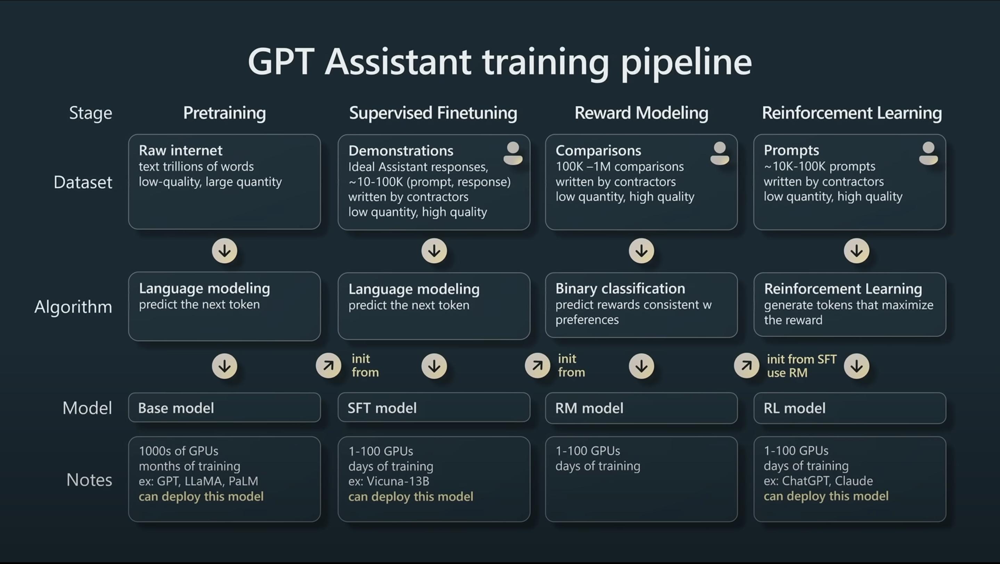

- [talk](https://www.youtube.com/watch?v=zjkBMFhNj_g&t=6s)

## What is LLM
- llama-2-70b: the 2nd iteration of the llama model with 70 billion parameters. Can be ran on a Macbook. 
	- parameters: 2 bytes (float 16) per parameter, totaling to 140 GB
	- run.c (500 lines of C code): the forward pass through the network architecture

### Training 
1. Procure ~10TB of text through web crawling 
2. run 6000 GPUs for 12 days 
3. get the parameters: compress 10TB to 140GB

The task is to predict the next word in the sequence given certain context. And it can be shown that prediction is in some way equivalent to compression. Simple an objective as it sounds, it will force the NN to learn a lot about the world. During generation, the network is essentially "dreaming" on the distribution it is trained on. 

#### Training the assistant (Q & A bots)
- Training/obtaining a *base model* (stage 1)
- Finetuning the base model given a smaller but high-quality training set using:
	- human-generated answers (stage 2)
	- human compare generated answers and choose the best ones (comparison is a much easier task than generation, optional stage 3): reinforcement learning from human feedback (RLHF) mentioned in the InstructGPT paper 
	- Increasingly, the labeling process becomes more and more automatic (human-LLM collaboration)

## LLM Scaling Laws 
- Performance of LLMs is a smooth function of **N** (# parameters) and **D** (the amount of training text). And the trends haven't topped out yet.

## LLM now
- tool use 
	- browser
	- code interpreter
		- Matplotlib for plotting 
	- DALL-E
- multi-modality 

## Future trends
- Thinking, fast and slow
	- LLM now only has "system 1" thinking (as described in the [[../cognitive science/Thinking, Fast and Slow]]) because it is trained to excel at next word prediction, and it does not think through a tree of many possibilities. What about trade time for accuracy and let GPT takes time and thinks
		- Tree of Thoughts: Deliberate Problem Solving with Large Language Models
- Self-improvement 
	- inspired by AlphaGo: by mimicking human, it cannot surpass human (stage 1); but by self-improvement (stage 2), it can
	- the main challenge: lack of a reward criterion 
- custom LLM 
- A deep metaphor between current OS and LLM OS: ![[LLO OS_Andrej.png]]
	- the RAM will be the context length of the LLM where data are retrieved to assemble an answer
This view naturally leads to: 
- LLM security 
	- jailbreak: eg. breaks the safety protocol of LLM by a different prompt, a different encoding, adding some pattern
	- prompt injection attack: inject some invisible prompts on top of the user prompt and thus prompts the LLM to do things that are not prompted by the user.
	- Data poisoning

# Another talk
- [video](https://www.youtube.com/watch?v=bZQun8Y4L2A)
