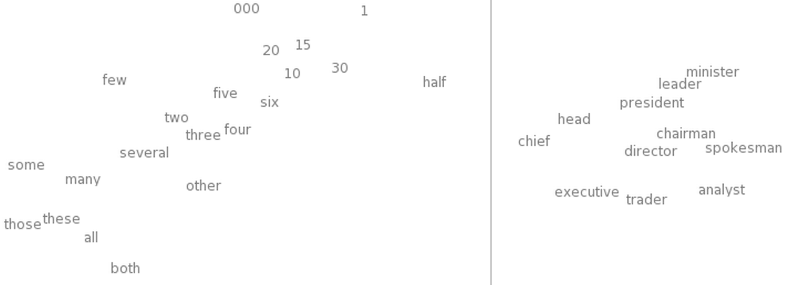

# Sequence
- vanilla NN, CNN: fixed size input, output, and computation step. 
- Sequence:
	- sequence output (one to many): image caption (one image to a sentence of words without pre-defined length)
	- sequence input (many to one): sentiment analysis (a sentence of words to a sentiment label)
	- sequence input and output: machine translation
	- synced sequence input and output: video classification each frame of the video is to be labelled. 

# RNN
RNNs combine the input vector with their state vector with a fixed (but learned) function to produce a new state vector. Like programs, it has certain inputs and some internal variables. In code: 
``` 
rnn = RNN()
y = rnn.step(x) # x is an input vector, y is the RNN's output vector
```
The RNN class has some internal state that it gets to update every time `step` is called. In the simplest case this state consists of a single _hidden_ vector `h`
```
class RNN:
  def step(self, x):
    # update the hidden state
    self.h = np.tanh(np.dot(self.W_hh, self.h) + np.dot(self.W_xh, x))
    # compute the output vector
    y = np.dot(self.W_hy, self.h)
    return y
```
This RNN’s parameters are the three matrices `W_hh, W_xh, W_hy`. The above is only step in processing $x_{t}$, $y_{t}$, and $h_{t}$. Below is the RNN with multiple steps unrolled. 


## Going deep 
We can arbitrarily stack RNN layers:
```
y1 = rnn1.step(x)
y = rnn2.step(y1)
```
# LSTM 
- [Colah's blog](https://colah.github.io/posts/2015-08-Understanding-LSTMs/) (2015)
A better variant of RNN. RNN is really hard to be trained to account for larger context. LSTMs are explicitly designed to avoid the long-term dependency problem. Remembering information for long periods of time is practically their default behavior. 

## The Core idea 
### Cell state
The cell state runs straight down the entire chain, with only some minor linear interactions. It’s very easy for information to just flow along it unchanged. The interactions are regulated by gates, a way to optionally let information through, that are composed out of a sigmoid neural net layer and a point-wise multiplication operation.

The sigmoid layer outputs numbers between zero and one, describing how much of each component should be let through. A value of zero means “let nothing through,” while a value of one means “let everything through!”

An LSTM has three of these gates, to protect and control the cell state.

## Step-by-step
### Step 1: forget old
The first step in our LSTM is to decide what information we’re going to throw away from the cell state. This decision is made by a sigmoid layer called the “forget gate layer.” It looks at $h_{t−1}$ (Note: $h$ is the output (denoted by $y$ previously), not the inner state of the RNN block used above)and $x_{t}$, and outputs a number between 0 and 1  for each number in the cell state $C_{t−1}$. A 1 represents “completely keep this” while a 0 represents “completely get rid of this.” 


### Step 2: get new
#### 2.1: get new candidate cell state
-  a tanh layer creates a vector of new candidate values, $\tilde C_{t}$, that could be added to the state.
#### 2.2: determine the weights for the new
-  a sigmoid layer called the “input gate layer” decides the magnitudes of the new values.


### Step 3: combine old and new
To get the new cell state $C_{t}$


### Step 4: output

Output will be based on our cell state, but will be a filtered version. 
#### 4.1: squash cell state
- through tanh (to push the values to be between −1 and 1) 
#### 4.2: gate 3
First, we run a sigmoid layer which decides what parts of the (squashed) cell state we’re going to output. 
#### 4.3: combine and output
Then, multiply the squashed cell state by the output of the sigmoid gate, so that we only output the parts we decided to.


## LSTM variants 
### Peephole connections 
- adding cell state to the inputs to each gate (maybe not to all of the gates)
### Coupled forget and input gates
- getting rid of the input gates by making it dependent on the forget gates. 

### Gated Recurrent Unit (GRU)
It combines the forget and input gates into a single “update gate.” It also merges the cell state and hidden state. The resulting model is simpler than standard LSTM models. 

## The next step
- Attention? 

# Char-level Language modeling using RNN/LSTM
- [Andrej's char-rnn article](https://karpathy.github.io/2015/05/21/rnn-effectiveness/) (2015)
- [char-rnn code](https://github.com/karpathy/char-rnn)
LSTM and RNN shares the same loop structure (see [RNN](#RNN)), with the difference being what is inside the block A. 

## Training 
- encode each character into a one-hot vector, the dimension of which is dependent on the vocab size. 
- randomly initialize the weight matrices, and add a softmax layer to the output of Y so that the output is standardized as output of the possibility function. 
- [A numpy implementation](https://gist.github.com/karpathy/d4dee566867f8291f086)

### Temperature 
$\text{Softmax}_T(z_i) = \frac{e^{z_i/T}}{\sum_{j=1}^n e^{z_j/T}}$
#### Effects of Temperature
1. **High Temperature (T > 1):** The softmax output becomes smoother: the differences between the largest and smallest values are decreased. This leads to a more uniform distribution where each class is more likely to be picked.
2. **Low Temperature (T < 1):** The softmax output becomes sharper, making the largest value(s) even more dominant. The highest logit has a disproportionately large impact on the distribution, pushing the probabilities towards 0 for all other classes except the one with the highest logit.
3. **T = 1:** The softmax function behaves normally without any modification to the logits.

## Applications 
- Paul Graham generator
	- data curated from [Paul Graham's articles](https://www.paulgraham.com/articles.html)
- Shakespeare
- Wikipedia
	- learnt the structured markdown
- Latex
- Linux source code 
- Generating Baby Names
## How does it work 
Investigate by visualization
### The evolution of samples while training

The picture that emerges is that the model first discovers the general word-space structure and then rapidly starts to learn the words; First starting with the short words and then eventually the longer ones. Topics and themes that span multiple words (and in general longer-term dependencies) start to emerge only much later.

### Visualizing the predictions
- Visualizing the predictions of softmax (confidence of the top 5 predictions)

### Visualize the “neuron” firings in the RNN
- visualize the "firing rate" (between -1 and 1) of a randomly selected neuron at the gated and tanh'd LSTM cell state (see [4.3 combine and output](#4.3%20combine%20and%20output)). 
- We can see some neuron is "specialized" at URL generation (it gets most excited when it generating chars of a URL following "http://")
- another neuron is specialized at generating wiki links (inside `[[]]`)
- a neuron that varies seemingly linearly across the `[[ ]]` environment. In other words its activation is giving the RNN a time-aligned coordinate system across the `[[ ]]` scope. The RNN can use this information to make different characters more or less likely depending on how early/late it is in the `[[ ]]` scope. 
- More examples: 

## Interesting papers and future direction
### RNN for computer vision
- [Recurrent Models of Visual Attention](https://arxiv.org/abs/1406.6247)

### Inductive reasoning, memory, and attention

#### Limitation of RNN
- bad at inductive reasoning: they memorize sequences extremely well, but they don’t necessarily always show convincing signs of generalizing in the _correct_ way
- size of the memory is not scaleable: it unnecessarily couples representation size to the amount of computation per step: if you double the size of the hidden state vector you’d quadruple the amount of FLOPS at each step due to the matrix multiplication

#### Soft attention
Fully-differentiable. Think of this as declaring a pointer in C that doesn’t point to a specific address but instead defines an entire distribution over all addresses in the entire memory, and dereferencing the pointer returns a weighted sum of the pointed content. 
- [Neural Machine Translation by Jointly Learning to Align and Translate](https://arxiv.org/abs/1409.0473)

[Transformer](Transformer.md) uses a variant of soft attention called Scaled Dot-Product Attention. 
#### Hard attention
Hard attention, by contrast, selects parts of the input to attend to in a discrete manner, often using sampling methods or other non-differentiable techniques.

# Word embeddings
- [Colah's blog](https://colah.github.io/posts/2014-07-NLP-RNNs-Representations/) (2014)
## Why Deep Learning works
A neural network with a hidden layer has universality: given enough hidden units, it can approximate any function. It means that a network can fit to any training data you give it. Like a look up table, each configuration (the weights and biases of the network) represents a specific mapping from inputs to outputs based on the training data.

But, it doesn’t mean that it will interpolate to new data points in a reasonable way. Universality isn’t an sufficient explanation for why neural networks work so well.

## Intro to word embedding
A word embedding $W: words \rightarrow  R^{n}$ is a parameterized function mapping words in some language to high-dimensional vectors (perhaps 200 to 500 dimensions). Typically, the function is a lookup table, parameterized by a matrix, θ, with a row for each word: $W_{θ}(w_{n})=θ_{n}$

### Training 
$W$ is initialized to have random vectors for each word. We train a NN with $W$in it on some tasks: 
- predicting whether a 5-gram (sequence of five words) is ‘valid.’
- predicting the next word in the sentence

The task itself it not that interesting. Then, we can the NN into two parts: $W$ and $R$, where $R$ is the layers after $W$ that does the prediction task, and extract $W$ to get the word embedding. 

### Visualizing
- Using t-sne to visualize: similar words are close together.


This is very powerful! The number of possible 5-grams is massive, but similar words being close together allows us to generalize from one sentence to a class of similar sentences exponentially.
- synonym words are interchangeable
- same-class words are interchangeable ("red" to "blue" and vice-versa)
- we can change multiple words (eg. “the wall is blue” →→ “the _ceiling_ is _red_”).

Moreover, it encodes analogies between words in terms of difference vectors between words.

All of these properties of $W$ are _side effects_ of training towards some simple task and all of that are obtained automatically. 

This seems to be a great strength of neural networks: they learn better ways to represent data, automatically. Representing data well, in turn, seems to be essential to success at many machine learning problems. **It is still true as of today (2024): [Why deep learning](Deep%20Learning%20Bootcamp_%20Kaiming%20He%20(3_7_24).md#Why%20deep%20learning).**

## Shared Representation
Given $W$ learnt on task A, we could use it on task B (retraining, transfer learning, and multi-task learning): representation of one kind of data -> multiple tasks. Conversely, we can learn a way to map multiple kinds of data into a single representation (shared representation).

### Example: bilingual word shared embedding

Train two word embeddings, $W_{en}$ and $W_{zh}$. Given translations, we optimize for an additional property: words that we know are close translations should be close together. 
- [Bilingual Word Embeddings for Phrase-Based Machine Translation](https://ai.stanford.edu/~wzou/emnlp2013_ZouSocherCerManning.pdf)

#### Step 1: Machine Translation (MT) alignments
From a parallel corpus, embeddings are initialized so that words that are translation to each other (government vs 政府) are close to each other in their embeddings. It uses the known embeddings of the source language as a reference to construct the embeddings in the target language. 

#### Step 2: Training with Context Objective
The objective enhances the distinct representation of a certain word in its usual contexts compared to some random contexts. 
$J_{CO} = \sum_{w_r \in VR} \max(0, 1 - f(c_w, d) + f(c_{w_r}, d))$
- `f` is a neural network function assessing how well a word fits into a given context.
- $c_{w}$ is the context window around the word `w`.
- $w_{r}$ are randomly chosen words from the vocabulary subset `VR`.
- $c_{w_{r}}$ is the context window for the random word $w_{r}$.
- `d` is the document from which the context is extracted.

#### Step 3: Train with Translation Equivalence Objective (TEO)
Preserve the initial MT alignments by using a loss function that minimizes the distance between the embeddings of words that are known translations of each other. 
$J_{TEO} = \| V_{zh} - A_{en \rightarrow zh} V_{en} \|^2$
- $V_{zh}$ and $V_{en}$ are the embedding matrices for Chinese and English, respectively.
- $A_{en \rightarrow zh}$ is the alignment matrix mapping English word embeddings to their Chinese counterparts.

An alignment matrix is a mathematical representation used in machine translation to map the relationships between words in two languages. In the context of word embeddings:
- Each row of an alignment matrix represents a word in the source language, and each column corresponds to a word in the target language.
- The elements of the matrix typically contain scores or probabilities reflecting how likely words in one language are to be translations of words in the other.
- This matrix is used during the optimization process in Translation Equivalence Training to adjust embeddings so that translationally equivalent words are close to each other in the vector space.

Intuitively, think of two languages as having a similar ‘shape’. By forcing them to line up at different points, they overlap and other points get pulled into the right positions.

### Example: image-word shared embeddings
- [DeViSE: A Deep Visual-Semantic Embedding Model](https://static.googleusercontent.com/media/research.google.com/en//pubs/archive/41473.pdf)

# Attention and Augmented Recurrent Neural Networks
- [blog](https://distill.pub/2016/augmented-rnns/) (2016)
 It introduces four directions that can be combined to augment RNN, and they all rely on **attention**. 
## Neural Turing Machines
Neural Turing Machines combine a RNN with an external memory bank (memory in NN is an array of vectors)

### Challenge
Read and write should be differentiable. In particular, we want to make them differentiable with respect to the location we read from or write to, so that we can *learn* where to read and write. However, memory addresses seem to be fundamentally discrete. 

### Solution
NTMs solve this by reading and writing everywhere, just to different extents, represented by an *attention distribution*. 
- read: a weighted sum of attention distribution and memory
- write: the new value of a position in memory is a convex combination of the old memory content and the write value: $M_i \leftarrow a_{i}w + (1-a_{i})M_i$ (w is the write value)

### How to update attention distribution
Use a combination of two different methods: content-based attention and location-based attention. 

#### Content-Based Attention
1. **Query Selector** is used to address memory locations with content similar to the query.
2. **Similarity Measure**: The similarity between the query vector and each memory vector is computed using a measure such as cosine similarity. Each memory location is assigned a weight based on this similarity score. The higher the similarity, the more attention that memory location receives.
3. **Softmax Normalization**: The raw similarity scores are often normalized to a probability distribution using a softmax function to ensure that the attention weights across all memory locations sum to one. 
#### Location-Based Attention
It allows the NTM to focus on memory locations relative to the location that was focused on during the last read or write operation. The new attention weights obtained from the content-based updates are passed to: 
1. **Interpolation**: Before using the new attention weights, the NTM can blend these weights with the weights from the previous step. This is controlled by an interpolation gate, a scalar that determines to what extent the new weights (based on content or other location strategies) should be mixed with the previous weights. 
2. **Convolution with Shift**: Convolve the interpolated weight vector with a predefined shift kernel. This convolution effectively shifts the attention distribution to the left or right, enabling the NTM to perform ordered, sequential tasks that depend on the relative positions of data in memory. 

## Attentional Interfaces: attention between NNs
Neural networks can focusing on part of a subset of the information they’re given. For example, at every time step, an RNN `B` can attend over different positions of the output of another RNN `A`. 

The attention distribution that determines to what extent `B` is attending to each position of the output of `A` is usually generated with [Content-Based Attention](#Content-Based%20Attention).

### Applications
A traditional sequence-to-sequence model has to boil the entire input down into a single vector and then expands it back out (encoder-decoder).
Attention avoids this by allowing the RNN processing the input (`A`) to pass along information about each word it sees, and then for the RNN generating the output (`B`) to attend words as they become relevant.
- Translation: the target language word is attending to words of the input reference language
- voice recognition: one RNN processs the audio and then have another RNN skim over it, focusing on relevant parts as it generates a transcript.

### Interface between CNN and RNN
Attention can also be used on the interface between a convolutional neural network and an RNN. This allows the RNN to look at different position of an image every step. 

#### Image Captioning
First, a conv net processes the image, extracting high-level features. Then an RNN runs to generate a description of the image. As it generates each word in the description, the RNN attends to the embeddings of the relevant parts of the image interpreted/produced by the conv nets. 

## Adaptive Computation Time
### Challenge
Standard RNNs do the same amount of computation for each time step. We want the NN to think more when things are hard. It also limits RNNs to doing $O(n)$ operations for a list of length $n$.

Therefore, we want RNNs to do different amounts of computation each step. In order for the network to learn how many steps to do, we want the number of steps to be differentiable: instead of deciding to run for a discrete number of steps, we have an **attention distribution** over the number of steps to run. The output is a weighted combination of the outputs of each step.

For more details, see https://distill.pub/2016/augmented-rnns/#adaptive-computation-time
## Neural Programmer
- [the paper](https://arxiv.org/pdf/1511.04834.pdf)
NN struggles to do some basic things like arithmetic. We want to have a way to fuse neural nets with normal programming. Neural programmer learns to create programs in order to solve a task. 

The generated program is a *sequence* of operations. Each operation is defined to operate on the output of past operations, and is generated one operation at a time by a controller RNN. At each step, the controller RNN outputs a probability distribution for what the next operation should be. The trick using attention is: instead of running the highest probability operation at each step, we run all of the operations and weight the outputs by the **attention distribution** to get a weighted sum. 

As long as the operations are differentiable. In this way, the Neural Programmer learns to produce programs without examples of good programs.

### Other approaches
- [Neural programmer-interpreter](https://arxiv.org/pdf/1511.06279.pdf): requires supervision of correct programs.

## The big picture
- a lot of interesting forms of intelligence are an interaction between the creative heuristic **intuition** of humans and some more crisp and careful **media**, like language or equations. The “augmented RNNs” are in line of this approach that connects RNNs to engineered media to extend their capabilities.
- Another approach is to combine intuition with “heuristic search.”
	- AlphaGo
	- DeepMath

> Interacting with media naturally involves making a sequence of taking an action, observing, and taking more actions. This creates a major challenge: how do we learn which actions to take? That sounds like a reinforcement learning problem and we could certainly take that approach. But the reinforcement learning literature is really attacking the hardest version of this problem, and its solutions are hard to use. The wonderful thing about attention is that it gives us an easier way out of this problem by taking all actions to varying extents. This works because we can design media—like the NTM memory—to allow fractional actions and to be differentiable. Reinforcement learning has us take a single path, and try to learn from that. Attention takes every direction at a fork, and then merges the paths back together.

### Issue of soft attention
It is also briefly mentioned in [above](#Soft%20attention). A major weaknesses of attention is that we have to take every “action” every step (calculates a weighted sum). This causes the computational cost to grow linearly as you do something like increase the amount of memory in a Neural Turing Machine.

# Seq2seq with Attention
- [Visualizing A Neural Machine Translation Model](https://jalammar.github.io/visualizing-neural-machine-translation-mechanics-of-seq2seq-models-with-attention/)
## Without Attention
- [Sequence to Sequence Learning with Neural Networks](https://proceedings.neurips.cc/paper_files/paper/2014/file/a14ac55a4f27472c5d894ec1c3c743d2-Paper.pdf)
- [Learning Phrase Representations using RNN Encoder–Decoder for Statistical Machine Translation](https://emnlp2014.org/papers/pdf/EMNLP2014179.pdf)

### Encoder-decoder 
Both are RNNs. The encoder RNN processes the input sentence, token by token (their embeddings), and transforms it into a series of hidden states. The final hidden state, aka context vector, encapsulates the entire information of the input sentence into a single dense vector. This context vector is then used to initialize the decoder's initial hidden state. 

The decoder takes (the embedding of) a special token "sos" (start of sequence) as input and the context vector as initial hidden state, updates its hidden state and outputs the next token. At the next time step it takes the token it just generated and repeat. 

## With Attention
The context vector turned out to be a bottleneck for models that deal with long sentences.
These papers introduced "attention":
- [Neural Machine Translation by Jointly Learning to Align and Translate](https://arxiv.org/abs/1409.0473)
- [Effective Approaches to Attention-based Neural Machine Translation](https://arxiv.org/abs/1508.04025)

On a high level, attention allows the model to focus on/amplifying the signal of the relevant parts of the input sequence as needed. Going back to the [Encoder-decoder](#Encoder-decoder) scheme, at each time step the decoder will now look at all the hidden states of the encoder. 

### Attention Mechanism in Decoder 
1. **Initial Setup**:
    - The decoder RNN takes the embedding of the `<EOS>` (end-of-sequence) token and the initial hidden state (h3, for example), which is often the final hidden state of the encoder. 
    - The RNN processes these inputs, producing an output vector and updating its hidden state to h4​. In many attention-based models, this output vector is typically ignored, and the focus is primarily on the updated hidden state h4​.
2. **Attention Step**:
    - **Attention Mechanism**: The core idea here is to dynamically select which parts of the input sequence are relevant at each step of the output generation. This is achieved using the attention mechanism.
    - **Calculating Context Vector (C4​)**: The attention mechanism takes all encoder hidden states and the current decoder hidden state h4​ to compute a context vector C4​. This vector is a weighted sum of the encoder hidden states, where the weights are determined by the attention scores. These scores are typically computed based on how well aligned each encoder state is with the current decoder state h4​.
3. **Combining Context and Hidden State**:
    - The context vector C4​ and the current decoder hidden state h4​ are concatenated. This concatenated vector combines both the focused information from the input (via C4​) and the ongoing decoding process's state (via h4​).
4. **Feedforward Neural Network**:
    - The concatenated vector is then passed through a feedforward neural network to get an output vector that is passed through a softmax layer to turn it into a probability distribution over the possible target vocabulary.
5. **Repetition for Subsequent Time Steps**

