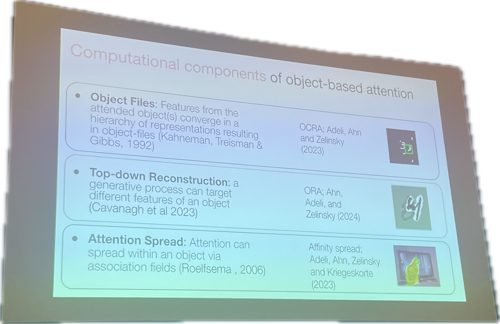

---
tags:
---
# Attention: accept, reject, or major revisions?
The best session I had. All the speakers are giving accessible, well-made, well-organized talks. And it is a topic I have some exposure before, when I brought up the weighted average illusion and used the word attention to account for the weightedness of the larger/darker dots, and Karen just refused to use attention to explain the phenomenon because she thought perception could explain it already.  
## Britt Anderson
- [slides](https://brittlab.uwaterloo.ca/assets/conferences/vssAttnSym24.pdf)
- Attention has so many meanings 
## Ruth Rosenholtz
- [Visual Attention in Crisis](https://scholar.google.com/citations?view_op=view_citation&hl=en&user=BfE3-m0AAAAJ&sortby=pubdate&citation_for_view=BfE3-m0AAAAJ:i2xiXl-TujoC)

## Wayne Wu
- [We know what attention is!](https://www.cell.com/trends/cognitive-sciences/abstract/S1364-6613(23)00286-3?dgcid=raven_jbs_etoc_email)

## Sarah Shomstein
- Attention is the current state of priority map, which is constantly changing. 

## Alon Zivony
- attention episode, attention as modulation 

At the Q&A session, there was one guy who verbally listed references in which proved "attention" is useful. Otherwise, the other things (e.g. peripheral vision) are not general enough to explain all those phenomenon. In the end, he just said: "take that!". 

# Deep Net on Objection-based Attention
## Time to consider time: Comparing human reaction times to dynamical signatures from recurrent vision models on a perceptual grouping task
- https://serre-lab.github.io/rnn_rts_site/
- really interesting: use C-RNN to model human RT
## Three theories of object-based attention implemented in deep neural network models
- [Reconstruction-guided attention improves the object recognition robustness of neural networks](https://scholar.google.com/citations?view_op=view_citation&hl=en&user=EdIFZpQAAAAJ&sortby=pubdate&citation_for_view=EdIFZpQAAAAJ:e5wmG9Sq2KIC)
- [Modeling the dynamics of spreading attention in objects: Do transformers behave like humans?](https://scholar.google.com/citations?view_op=view_citation&hl=en&user=EdIFZpQAAAAJ&sortby=pubdate&citation_for_view=EdIFZpQAAAAJ:R3hNpaxXUhUC)
- 

## Combining Generative Adversarial Networks (GANs) with behavior and brain recordings to study scene understanding
- https://www.scenegrammarlab.com/